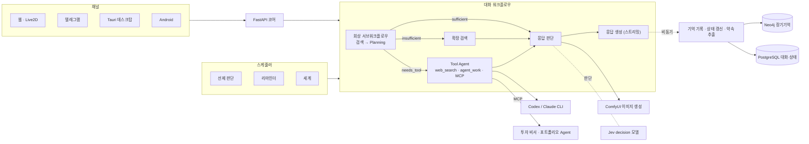

## Overview

캐릭터 페르소나를 가진 AI 컴패니언이자 개인 비서 Agent입니다. 대화를 장기기억으로 쌓고, 자신의 상태와 일상을 가지며, 필요하면 먼저 말을 겁니다. 복잡한 작업은 Codex/Claude CLI에 위임하고, 함께 개발한 [투자 비서 Agent](../investment-agent/)·[포트폴리오 Agent](../portfolio-agent/) 같은 다른 Agent들을 MCP로 Tool처럼 호출해 일상 대화 안에서 업무를 처리합니다.

## Demo

## Key Features

### 1. 장기기억 Knowledge Graph
- 응답을 보낸 직후 비동기로 관측 후보를 추출합니다. 대화 흐름은 막지 않습니다.
- 엔티티 해석: 임베딩으로 기존 엔티티 후보를 찾고, LLM이 같은 대상인지 판단합니다.
- 단일 Entity 노드와 append-only Observation 관계로 저장합니다. 같은 관계가 반복되는 것 자체를 선호의 강도 신호로 씁니다.
- 회상은 벡터 + BM25 검색을 RRF로 결합합니다.
- 매일 새벽 **일일 회고**를 돌려 전날 관측을 근거 ID로 연결된 Memory로 요약합니다. 원본 관측은 보존합니다.

### 2. 공유 회상 서브워크플로우
- 검색 → Planning(`sufficient` / `insufficient` / `needs_tool`) → 확장 검색 또는 Tool Agent 순서입니다.
- 일반 대화와 선제적 대화가 같은 서브워크플로우를 조립해 사용합니다.

### 3. Tool Agent: 개인 비서 기능
- 회상 단계의 Planning이 도구가 필요하다고 판단하면(`needs_tool`) Tool Agent로 라우팅합니다.
- `web_search`: Tavily 웹 검색
- `agent_work`: 격리된 임시 디렉터리에서 Codex/Claude CLI에 리서치, 계산, 코딩, 작성 같은 작업을 위임합니다.
- **Agent as Tool**: MCP 클라이언트로 투자 비서 Agent, 포트폴리오 Agent 같은 다른 Agent를 Tool로 호출해 결과를 대화에 녹입니다.
- 대화 그래프는 턴당 LLM 호출 수를 예측할 수 있는 bounded-step 구조로 유지하고, 자유로운 도구 루프는 ToolAgentNode 안에서만 허용합니다.

### 4. 선제적 대화
- 독립 스케줄러가 대화 공백, 최근 기억, 상태를 보고 먼저 말을 걸지 판단합니다.
- 응답 속 약속(「내일 알려줄게」)을 추출해 리마인더로 저장하고, 기한이 되면 연락합니다.
- 웹 연결 여부에 따라 전달 채널(웹 / 텔레그램)을 자동으로 고릅니다.

### 5. 영속적 내적 상태와 세계 시뮬레이션
- 매 턴 델타 기반으로 내적 상태를 갱신합니다: 호감도, 현재 감정, 지속 불만, 최근 생각.
- 백그라운드에서 주기적으로 행동·장소·의상을 정하는 「세계」를 돌립니다.
- 두 상태가 응답 생성과 선제 판단에 함께 반영됩니다.

### 6. Jev 하이브리드 판단 (LLM 효율화)
- 자유 텍스트 대신 타입이 정해진 답(boolean/choice)과 확률만 돌려주는 경량 decision 모델 **Jev**를 LLM과 하이브리드로 씁니다.
- 노드별 모드를 설정만으로 바꾸고 되돌릴 수 있습니다.

| 모드 | 동작 |
|---|---|
| `llm` | LLM만 사용 |
| `shadow` | LLM 판단을 쓰고, Jev는 응답 경로 밖에서 비교 기록만 남김 |
| `cascade` | Jev confidence가 임계값 이상이면 채택, 아니면 LLM |
| `jev` | Jev를 채택하고, 호출 실패 시에만 LLM으로 폴백 |

- **게이트 패턴**: 대부분 「변경 없음」으로 끝나는 노드 앞에서, LLM 호출이 필요한지만 Jev가 먼저 판단합니다.
- 운영 중에도 일부 턴을 섀도로 돌리는 점검 샘플링으로 불일치를 계속 측정합니다.

### 7. 로컬 이미지 생성 (ComfyUI 연동)
- Windows GPU에서 도는 ComfyUI를 WSL의 코어 서버가 HTTP API로 호출합니다.
- LLM이 상황 묘사를 태그형 포즈 프롬프트로 바꾸고, 세계 상태의 의상·장소와 결합합니다.
- 워크플로우: Base 모델 + Character LoRA → 얼굴·손 bbox 검출 디테일러
- 응답 판단 노드가 필요하다고 판단할 때만, 비동기로 드물게 전송합니다.

### 8. 멀티 채널 단일 세션
- 웹(Live2D), 텔레그램, Tauri 데스크탑(월페이퍼 모드), Android 앱이 하나의 대화 세션을 공유합니다.
- 응답은 토큰 스트리밍으로 전달합니다.

## Architecture

## Challenges

1. **토큰 스트리밍과 structured output의 충돌**
   - 문제: 구조화 출력은 생성 도중 불완전한 JSON 조각이 나와 실시간 스트리밍을 할 수 없었습니다.
   - 해결: 판단은 structured output 노드가, 응답 텍스트는 스트리밍 전용 노드가 맡도록 역할을 나눴습니다.
2. **선제 메시지와 사용자 메시지의 경합**
   - 문제: 먼저 말을 거는 메시지를 만드는 사이에 사용자가 말을 걸면 맥락이 어긋난 메시지가 전송됐습니다.
   - 해결: 스케줄러 간 틱 잠금, 수신 활동 번호, 생성 후와 전송 직전의 재검증으로 낡은 메시지 전송을 막았습니다.
3. **쌓이기만 하는 기억**
   - 문제: append-only 관측이 늘수록 회상 품질과 비용이 나빠졌습니다.
   - 해결: 원본은 보존하고, 근거 ID로 연결된 일일 회고 Memory 계층을 더해 Memory 중심으로 회상합니다.
4. **판단 노드의 LLM 비용과 지연**
   - 문제: 여러 판단 노드가 매 턴 LLM을 호출했는데, 대부분 결과가 「변경 없음」이었습니다.
   - 해결: Jev 게이트와 캐스케이드를 도입하고, 섀도 모드로 실데이터 일치율을 측정한 뒤 노드별로 승격했습니다.
5. **제한된 GPU에서의 이미지 품질과 지연**
   - 문제: 12GB GPU에서 대화 중에 이미지를 생성해야 했습니다.
   - 해결: v1을 Base + LoRA로 최소화하고, 얼굴·손만 검출 디테일러로 보정했습니다. 전송은 비동기·저빈도로 설계했습니다.

## Tech Stack

| 영역 | 기술 |
|---|---|
| AI | Google ADK, Gemini 외 LLM(OpenRouter), Jev, ComfyUI(Base + LoRA) |
| Backend | Python, FastAPI, Tavily, Codex/Claude CLI |
| Data | Neo4j, PostgreSQL |
| Client | Vite + TypeScript + PixiJS(Live2D), Tauri, Android, Telegram Bot |
