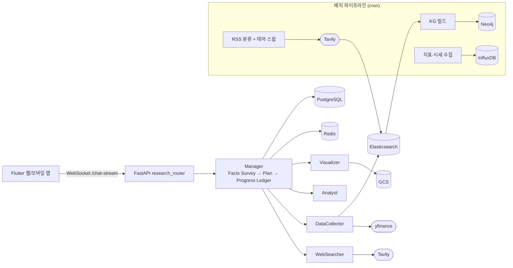

## Overview

주식·경제 관련 질문을 받으면 Manager 에이전트가 필요한 정보를 먼저 정리하고 계획을 세웁니다. 이후 웹 검색, 데이터 수집, 분석, 시각화 에이전트에게 단계별로 작업을 위임하고, 결과를 종합해 차트와 출처를 포함한 리서치 답변을 스트리밍합니다. Flutter 웹/모바일 앱의 리서치 채팅이 진입점입니다.

## Demo

## Key Features

### 1. Orchestrator 기반 동적 위임
WebSocket `/chat-stream`으로 들어온 질문을 Manager가 다음 순서로 처리합니다.
- **Facts Survey**: 질문에 이미 주어진 사실, 찾아야 할 사실, 추론할 사실을 정리합니다.
- **Plan**: 팀 구성을 바탕으로 초기 계획을 세웁니다.
- **Progress Ledger 루프**: 매 단계 structured output으로 목표 달성 여부, 답변 가능 여부, 진행·반복 여부, 다음 담당 에이전트와 지시를 판단합니다. 진행이 없거나 같은 단계가 반복되면 stall 카운트를 올리고, 상한(3)에 도달하면 루프를 끝냅니다.
- **의존성 검사**: 에이전트마다 선행 에이전트를 선언합니다(예: Analyst는 DataCollector 또는 WebSearcher, Visualizer는 DataCollector). 조건을 충족하지 못하면 위임하지 않고 Manager에게 다시 판단하게 합니다.
- **Final Answer**: 분석 결과와 시각화 메타데이터를 바탕으로 최종 답변을 생성합니다.

### 2. 전문 에이전트
| 에이전트 | 역할 |
|---|---|
| WebSearcher | Tavily 웹·뉴스 검색 |
| DataCollector | yfinance 주가·종목 뉴스, Elasticsearch 뉴스 하이브리드 검색 |
| Analyst | 수집 데이터 기반 분석 |
| Visualizer | LLM이 pandas/matplotlib 코드를 생성·실행해 차트 이미지 생성 |

### 3. WebSocket 스트리밍 프로토콜
- 태그로 메시지 종류를 구분합니다: `SYSTEM`(진행 단계), `URLS`(참고 기사), `IMAGES`(차트), `MARKDOWN`(답변 토큰).
- 클라이언트 ACK로 메시지 순서를 맞춥니다.

### 4. 멀티턴 세션
- 세션 히스토리를 다음 질문의 컨텍스트로 사용하고, 세션·메시지·차트를 저장해 다시 열람할 수 있습니다.

### 5. 경제 Knowledge Graph
- **Identity/State 2계층 스키마**: 고유 엔티티(회사, 지표 등)는 UPSERT하고, 시점별 사실(실적, 가격 변동 등)은 State로 INSERT해 시간축을 보존합니다.
- **seed 카탈로그**: 회사, 미국 거시지표, 원자재·통화, 투자 테마, 실적·FOMC 일정을 미리 넣고 뉴스에서 추출한 사실을 연결합니다.
- **질의 템플릿 도구**: LLM이 읽기 전용 Cypher 템플릿과 인자를 고르는 방식으로 그래프를 조회합니다.
- **골든셋 평가**: 같은 질문 세트로 「ES만」과 「ES + KG」 조건을 비교해 KG의 효과를 측정합니다.

## Data & Storage

| 저장소 | 역할 |
|---|---|
| Elasticsearch | 경제 뉴스 색인, BM25 + 벡터 RRF 하이브리드 검색 |
| Redis | 요청 중 에이전트 작업 메모리(수집 데이터, 기사, 실행 이력), 세션 대화 히스토리(TTL) |
| PostgreSQL | 채팅 세션, 메시지, 질의 로그 |
| GCS | Visualizer가 생성한 차트 이미지 |
| Neo4j | 경제 Knowledge Graph |
| InfluxDB | 거시지표(FRED), 원자재·통화 시세 시계열 |

외부 데이터 소스: yfinance(주가·종목 뉴스), Tavily(웹·뉴스 검색), investing.com RSS, FRED

## Architecture

## Challenges

1. **질문마다 다른 분석 경로**
   - 문제: 고정 파이프라인으로는 단순 시세 질문과 복합 분석 질문을 함께 처리할 수 없었습니다.
   - 해결: Progress Ledger로 매 단계 다음 담당자를 동적으로 정하고, 진행·반복 여부를 판단하는 stall 감지로 무한 루프를 막았습니다.
2. **에이전트 간 실행 순서 제약**
   - 문제: 데이터 없이 분석이나 시각화가 먼저 실행되면 근거 없는 내용이 만들어졌습니다.
   - 해결: 에이전트별 의존성(AND/OR 조합)을 선언하고, 위임 전에 실행 이력으로 검사했습니다.
3. **뉴스 수집 차단**
   - 문제: 기사 페이지를 직접 크롤링하는 방식이 봇 차단에 막혔습니다.
   - 해결: RSS 제목을 LLM이 분류해 관련 기사만 Tavily로 검색하는 트랙과, 고정 테마 스윕 트랙으로 수집 구조를 바꿨습니다.
4. **KG 컨텍스트 과다**
   - 문제: 벡터로 진입한 엔티티의 주변을 통째로 펼치면 컨텍스트가 평균 1.37만 자가 되어 핵심 수치를 놓쳤습니다.
   - 해결: 질문 유형별 질의 템플릿을 도구로 노출해 컨텍스트를 평균 약 2.5천 자(약 1/5)로 줄였고, 골든셋 20문항에서 사실 재현율은 같은 수준을 유지했습니다.

## Tech Stack

| 영역 | 기술 |
|---|---|
| AI | Gemini, Multi-Agent Orchestration, Graph RAG |
| Backend | Python, FastAPI, WebSocket |
| Data | Elasticsearch, Redis, PostgreSQL, Neo4j, InfluxDB, GCS |
| Infra | GCP, Docker, Cloud Build, cron |
| Frontend | Flutter (웹/모바일) |
