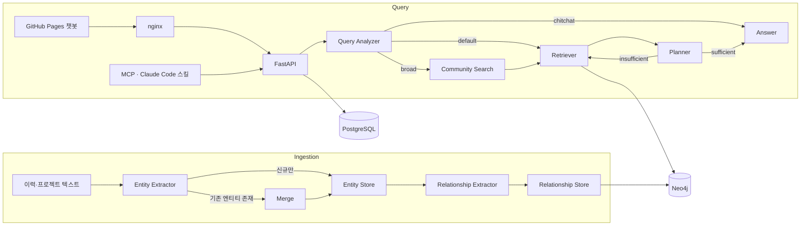

## Overview

이력과 프로젝트 경험을 텍스트로 입력하면 LLM이 엔티티와 관계를 추출해 Knowledge Graph로 쌓습니다. 질문이 들어오면 질문 유형에 맞는 검색 경로로 근거를 모아 답변합니다. **지금 이 페이지 오른쪽 아래의 챗봇이 바로 이 시스템입니다.**

## Demo

## Key Features

### 1. Ingestion 워크플로우 (Google ADK 그래프)
- 엔티티 추출 → 기존 엔티티가 있으면 병합 → 저장 → 관계 추출 → 저장 순서의 그래프 워크플로우입니다.
- 엔티티 7종(Project, Technology, Company, Role, Achievement, Topic, Challenge)과 관계 7종으로 스키마를 고정해 추출 결과를 일관되게 유지합니다.
- 모든 LLM 노드는 Pydantic structured output을 사용합니다.

### 2. RAG 워크플로우
- **Query Analyzer**가 질문을 분석해 라우팅합니다.
  - 잡담(chitchat) → 바로 답변
  - 넓은 질문(broad) → 커뮤니티 검색 → Retriever
  - 그 외 → Retriever
- **Planner**가 모은 근거가 충분한지 판단하고, 부족하면 Retriever를 다시 실행합니다(최대 3회).

### 3. 검색
- 벡터 + 전문 검색 하이브리드를 RRF로 결합합니다.
- PPR(Personalized PageRank)로 관련 엔티티를 확장합니다.
- Leiden 알고리즘으로 2레벨 계층 커뮤니티를 만들고, LLM이 커뮤니티마다 이름과 요약을 붙입니다.

### 4. 멀티턴 대화
- ADK 세션(PostgreSQL)과 대화 히스토리를 유지하고, 이전 턴의 질문 분석 결과를 다음 턴에 주입합니다.

### 5. 접근 제어와 모드
- 데이터마다 public/private visibility를 두고, admin 토큰이 있을 때만 private 데이터까지 검색합니다.
- 사실 기반 Q&A(qa)와 심층 분석(analyst, admin 전용) 모드를 제공합니다.

### 6. 연동과 운영
- GitHub Pages 포트폴리오에 SSE 스트리밍 챗봇 위젯으로 연동했습니다.
- MCP 서버로 Claude Code 스킬에서 포트폴리오를 조회합니다.
- GCP VM에 nginx + oauth2-proxy로 배포하고, OpenTelemetry → Jaeger로 워크플로우를 트레이싱합니다.

## Architecture

## Challenges

1. **넓은 질문 검색**
   - 문제: 「어떤 프로젝트를 했어?」처럼 특정 엔티티가 없는 질문은 엔티티 유사도 검색으로는 전체를 커버하지 못했습니다.
   - 해결: Leiden 계층 커뮤니티와 LLM 커뮤니티 요약을 만들고, Query Analyzer가 broad 질문을 커뮤니티 검색으로 라우팅하도록 했습니다.
2. **한 번의 검색으로 부족한 근거**
   - 문제: 여러 홉을 거쳐야 하는 질문은 1회 검색으로 근거가 모자랐습니다.
   - 해결: Planner가 근거 충분성을 판단해 Retriever를 반복 실행하는 루프를 만들고, 상한(3회)을 둬 지연을 제어했습니다.
3. **공개 챗봇과 관리 기능의 분리**
   - 문제: 같은 API를 공개 위젯과 관리자 도구(MCP, 인제스트)가 함께 사용합니다.
   - 해결: nginx 경로 화이트리스트, Bearer 토큰 기반 visibility 필터, admin 전용 analyst 모드로 공개 범위와 권한을 나눴습니다.

## Tech Stack

| 영역 | 기술 |
|---|---|
| AI | Google ADK, Gemini, Graph RAG, Leiden, PPR |
| Backend | Python, FastAPI, FastMCP |
| Data | Neo4j, PostgreSQL |
| Infra | GCP VM, Docker Compose, nginx, oauth2-proxy, OpenTelemetry, Jaeger |
| Frontend | GitHub Pages(Jekyll), SSE 챗봇 위젯 |
