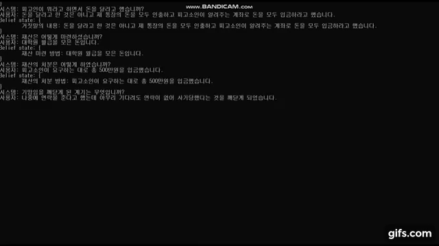

<link rel="stylesheet" href="assets/css/style.css" />

  <aside class="toc">
    

      
Contents

      <a href="#skill" class="toc-link">Skill</a>
      <a href="#education" class="toc-link">Education</a>
      <a href="#experience" class="toc-link">Experience</a>
      <a href="#research" class="toc-link">Research</a>
      <a href="#side-project" class="toc-link">Side Project</a>
      <a href="#academic-project" class="toc-link">Academic Project</a>
      <a href="#record" class="toc-link">Record</a>
      <a href="#certification" class="toc-link">Certification</a>
      <a href="#contact" class="toc-link">Contact</a>
    

  </aside>
  <main class="content">
    

      

        

            
            

            <h1 style="margin-bottom:6px;">
                전현민 (Hyunmin Jeon)
            </h1>
            

                AI & NLP Engineer
                AI Agent
                RAG
                Graph RAG
                NLP
            

            

        

        

          

            
Birth

            
July 11, 1995

          

          

            
Location

            
Seoul, Republic of Korea

          

        

      

      

        <h3 style="margin-top:0;">Contact</h3>
        

          <a class="btn" href="mailto:gusalsrhkals@naver.com">✉️ Email</a>
          <a class="btn" href="http://www.linkedin.com/in/jhm9507" target="_blank">💼 LinkedIn</a>
          <a class="btn" href="https://github.com/gusalsdmlwlq" target="_blank">🐙 GitHub</a>
        

      

    

    <h2 id="skill">Skill</h2>
    

      

        

          
AI

        

         
        

          LLMRAGPrompt Engineering
          Generative AgentMulti-Agent Orchestration
          Knowledge GraphGraph RAG
          NLPTask-oriented Dialogue System
          MCP
        

      

      

        

          
Language / Library / Framework

        

         
        

          Python
          Google ADK
          Langchain
          FastAPI
          Celery
          Airflow
          Pytorch
          Flutter
        

      

      

        

          
Data

        

         
        

          Elastic Search
          Neo4j
          InfluxDB
          PostgreSQL
          MongoDB
          Redis
        

      

      

        

          
Infra / DevOps / Cloud

        

         
        

          Git
          Docker
          Jenkins
          GCP, GKE
          Firebase
          Nginx
        

      

    

    <h2 id="education">Education</h2>
    

      

        

          
POSTECH / M.S.

          
2019.09 ~ 2021.08

        

        

          <em>Computer Science & Engineering</em>
          <em>GPA 3.93 / 4.3</em>
          <em>Advisor: Gary Geunbae Lee</em>
        

      

      

        

          
Hanyang University ERICA / B.S.

          
2014.03 ~ 2019.08

        

        

          <em>Computer Science & Engineering</em>
          <em>GPA 4.27 / 4.5</em>
        

      

    

    <h2 id="experience">Experience</h2>
    

      

        

          
넷마블 / AI & NLP Engineer

          
2023.12 ~ Current

        

        

          <em>AI Agent</em><em>RAG</em><em>Knowledge Graph</em><em>Graph RAG</em><em>NLP</em><em>Python</em><em>GCP</em>
        

        <ul class="list-tight">
          <li>사내 Agentic RAG 시스템 개발</li>
          <li>Knowledge Graph 기반 RAG Agent 개발</li>
          <li>데이터 분석 및 보고서 작성 Agent 개발</li>
          <li>게임 가이드 챗봇 개발</li>
          <li>LLM & Agent 방법론 리서치</li>
        </ul>
      

      

        

          
컴투스플랫폼 / AI & NLP Engineer

          
2021.09 ~ 2023.11

        

        

          <em>NLP</em><em>Chatbot</em><em>Python</em><em>Pytorch</em>
        

        <ul class="list-tight">
          <li>사내 RAG 챗봇 개발</li>
          <li>그룹사 HR 챗봇 개발</li>
          <li>모바일 게임 FAQ 챗봇 개발</li>
          <li>A/B 테스트를 통한 모델 분석</li>
          <li>모델 학습 및 평가 자동화를 위한 웹 서비스 개발</li>
        </ul>
      

      

        

          
와이즈넛 / Intern

          
2019.01 ~ 2019.02

        

        

          <em>ML</em><em>Python</em><em>Scikit-learn</em><em>Node.js</em>
        

        <ul class="list-tight">
          <li>산학 협력 캡스톤 디자인으로 SVM을 활용한 웹 크롤러 개발</li>
        </ul>
      

    

    <h2 id="research">Research</h2>
    

      <h3>Paper</h3>
      <ul class="list-tight">
        <li><b>Schema Encoding for Transferable Dialogue State Tracking</b> — COLING 2022 · <a href="https://aclanthology.org/2022.coling-1.28/" target="_blank">ACL Anthology</a></li>
        <li><b>DORA: Towards Policy Optimization for Task-oriented Dialogue System with Efficient Context</b> — Computer Speech & Language · <a href="https://www.sciencedirect.com/science/article/pii/S0885230821001078" target="_blank">Elsevier</a></li>
        <li><b>Domain State Tracking for a Simplified Dialogue System</b> — arXiv · <a href="https://arxiv.org/abs/2103.06648" target="_blank">arXiv</a></li>
        <li><b>Simplified Task-Oriented Dialogue System using Domain State</b> — AAAI 2021 (DSTC-9) · <a href="https://drive.google.com/file/d/1UTFyFMTvW7P1UR79mX25FgserYaPc4Gd/view" target="_blank">Google Drive</a></li>
        <li><b>도메인 상태를 이용한 다중 도메인 대화 상태 추적</b> — HCLT 2020 · <a href="https://drive.google.com/file/d/1JpVnJ0cOxBEDys-TfPCNb5Wapvg4ZImW/view?usp=sharing" target="_blank">Google Drive</a></li>
        <li><b>수기 답안지 자동 채점 시스템</b> — KCC 2019 · <a href="https://www.dbpia.co.kr/journal/articleDetail?nodeId=NODE08763608" target="_blank">DBpia</a></li>
      </ul>
      <h3 style="margin-top:24px;">Patent</h3>
      <ul class="list-tight">
        <li><b>대화 로봇을 활용한 법률문서 자동작성 서버 및 그것의 동작방법</b> — 출원번호: 10-2021-0009714</li>
      </ul>
    

    <h2 id="side-project">Side Project</h2>
    

      

        

          
투자 비서 Agent

        

        

          <em>Generative Agent</em><em>Multi-Agent</em><em>Knowledge Graph</em><em>Python</em><em>Elastic Search</em><em>Neo4j</em><em>Flutter</em><em>GCP</em>
        

        <ul class="list-tight">
          <li>Multi-Agent 기반 주식 투자 비서 서비스 개발
              <ul>
                  <li>동적 Planning을 통한 Multi-Agent Orchestration</li>
                  <li>데이터 수집, 분석, 시각화 등</li>
              </ul>
          </li>
          <li>경제 데이터 분석 인사이트 및 경제 지식 제공
              <ul>
                  <li>주식 및 경제 지표 API 연동</li>
                  <li>뉴스 데이터 수집 및 RRF 검색</li>
                  <li>웹 검색 API 연동</li>
              </ul>
          </li>
          <li>Knowledge Graph 기반 RAG
            <ul>
              <li>LLM으로 주식 및 경제 관련 데이터 기반 Knowledge Graph 구축</li>
              <li>Knowledge Graph를 연동하여 Graph RAG 구현</li>
            </ul>
          </li>
          <li>Flutter로 웹 / 모바일 앱 구현
            <ul>
              <li>GCP Cloud Run으로 웹 서비스 배포</li>
              <li>GCP VM으로 Nginx & FastAPI 서버 배포</li>
              <li>웹 소켓 통신으로 답변 스트리밍</li>
            </ul>
          </li>
        </ul>
      

      

        

          
포트폴리오 Agent

        

        

          <em>Generative Agent</em><em>Agentic RAG</em><em>Graph RAG</em><em>Knowledge Graph</em><em>Python</em><em>Neo4j</em><em>GCP</em><em>Github Page</em>
        

        <ul class="list-tight">
          <li>이력/경력 사항 및 업무/프로젝트 경험을 관리하기 위한 Graph RAG Agent 서비스 개발
              <ul>
                  <li>텍스트 형태로 데이터를 입력하면 자동으로 Knowledge Graph로 빌드</li>
                  <li>Knowledge Graph 기반으로 이력/경력 및 업무/프로젝트 관련 질의응답</li>
              </ul>
          </li>
          <li>Github Page 기반의 웹 포트폴리오 페이지에 Graph RAG 기반 질의응답 기능을 챗봇 형태로 연동
              <ul>
                  <li>GCP VM으로 Nginx & FastAPI 서버 배포</li>
                  <li>Github Page에서 이벤트 스트리밍 기반 통신</li>
              </ul>
          </li>
        </ul>
      

      

        

          
9th Dialog System Technology Challenge (DSTC-9)

        

        

          <em>Task-oriented Dialogue System</em><em>Dialogue State Tracking</em><em>Python</em><em>Pytorch</em>
        

        <ul class="list-tight">
          <li>대화 시스템 챌린지인 DSTC-9에 참여 · <a href="https://sites.google.com/dstc.community/dstc9/aaai-21-workshop" target="_blank">DSTC-9 Workshop on AAAI 2021</a></li>
          <li>Microsoft가 주최한 <b>Multi-domain Task-oriented Dialog Challenge II</b> 트랙에 참여</li>
          <li>Multi-domain task-oriented dialogue system 개발 및 포스터 세션 발표 · <a href="https://drive.google.com/file/d/18uRvgZtYzHQ-QA7jNrKhD4hBYn3brbcn/view?usp=sharing" target="_blank">포스터</a>
          </li>
        </ul>
      

      

        

          
법률 챗봇

        

        

          <em>Dialogue State Tracking</em><em>Python</em><em>Pytorch</em>
        

        <ul class="list-tight">
          <li>국가 R&D 과제로 고소장 문서 자동 작성을 위한 법률 챗봇 개발</li>
          <li>GPT-2 기반의 belief tracker와 규칙 기반의 NLG를 결합</li>
          <li>SKT AI의 KoGPT-2를 법률 판례 데이터와 법률 상담 대화 데이터로 2차 pre-training 하여 LM으로 사용 · <a href="https://github.com/SKT-AI/KoGPT2" target="_blank">KoGPT-2</a> / <a href="https://aihub.or.kr/aidata/29" target="_blank">법률 판례 데이터</a> / <a href="https://github.com/gusalsdmlwlq/KoGPT2-LegalLM" target="_blank">LM</a></li>
          <li>기업과 협업한 과제인 관계로 법률 상담 대화와 소스 코드는 비공개</li>
          

            
프로토타입 데모 영상

            
          

        </ul>
      

    

    <h2 id="academic-project">Academic Project</h2>
    

      

        

          
DS-DST belief tracker 논문 구현
      
        

        <ul class="list-tight">
          <li>Find or Classify? Dual Strategy for Slot-Value Predictions on Multi-Domain Dialog State Tracking (Zhang et al., 2019) · <a href="https://www.aclweb.org/anthology/2020.starsem-1.17/" target="_blank">논문</a></li>
          <li>Pytorch 구현 · <a href="https://github.com/gusalsdmlwlq/DS-DST" target="_blank">Github</a></li>
        </ul>
      

      

        

          
KoGPT-2 summarization 모델
      
        

        <ul class="list-tight">
          <li>SKT AI의 KoGPT-2와 신문 기사 요약 데이터를 사용하여 summarization 모델 구현 · <a href="https://corpus.korean.go.kr/main.do#down" target="_blank">신문 기사 요약 데이터</a></li>
          <li>Pytorch 구현 · <a href="https://github.com/gusalsdmlwlq/KoGPT2-Summarization" target="_blank">Github</a></li>
        </ul>
      

      

        

          
Machine translation 모델
      
        

        <ul class="list-tight">
          <li>Transformer와 ISWLT 2016 EN-DE 데이터를 사용하여 영어 → 독일어 translation 모델 구현 · <a href="https://wit3.fbk.eu/2016-01" target="_blank">ISWLT 2016 데이터</a></li>
          <li>Attention is all you need (Vaswani et al., 2017) 논문 transformer 구현 · <a href="https://papers.nips.cc/paper/2017/hash/3f5ee243547dee91fbd053c1c4a845aa-Abstract.html" target="_blank">논문</a></li>
          <li>Pytorch 구현 · <a href="https://github.com/gusalsdmlwlq/Machine-Translation" target="_blank">Github</a></li>
        </ul>
      

      

        

          
Sentiment analysis 모델
      
        

        <ul class="list-tight">
          <li>Bidirectional LSTM과 Naver sentiment movie corpus (NSMC) 데이터를 사용하여 sentiment analysis 모델 구현 · <a href="https://github.com/e9t/nsmc" target="_blank">NSMC 데이터</a>
            <ul>
              <li>Tensorflow 구현 · <a href="https://github.com/gusalsdmlwlq/Sentiment-Classification" target="_blank">Github</a></li>
            </ul>
          </li>
          <li>2019 오픈인프라 개발 경진대회에서 Youtube 댓글 분석 모델 구현
            <ul>
              <li>Bidirectional LSTM과 NSMC & Sentiment 140 데이터를 사용하여 sentiment analysis 모델 구현 · <a href="http://help.sentiment140.com/for-students" target="_blank">Sentiment 140 데이터</a></li>
              <li>Docker와 Tensorflow serving을 사용하여 모델 배포</li>
              <li>Tensorflow 구현 · <a href="https://github.com/open-tube/open-tube" target="_blank">Github</a></li>
            </ul>
          </li>
        </ul>
      

      

        

          
Machine learning 웹 크롤러
      
        

        <ul class="list-tight">
          <li>캡스톤 디자인으로 machine learning을 사용한 웹 크롤러 개발</li>
          <li>Scikit-learn의 SVM을 사용</li>
          <li>Puppeteer 라이브러리 사용</li>
          <li>Python & Node.js 구현 · <a href="https://github.com/gusalsdmlwlq/Crawler" target="_blank">Github</a></li>
        </ul>
      

      

        

          
지하철 빈 자리 체크 시스템
      
        

        <ul class="list-tight">
          <li>Global-PBL (in SIT, Japan) 프로그램 과제로 가상의 지하철의 빈 좌석 수를 체크하는 시스템 개발</li>
          <li>YOLO 알고리즘 사용</li>
          <li>Raspberry Pi와 Android 연동</li>
          <li>Python & Android 구현 · <a href="https://github.com/gusalsdmlwlq/RaspberryPi" target="_blank">Github</a></li>
        </ul>
      

    

    <h2 id="record">Record</h2>
    

      <ul class="list-tight">
        <li><b>DSTC-9 (2020.10.23)</b> — 4위 (Team 6) · <a href="https://convlab.github.io/" target="_blank">리더보드</a></li>
        <li><b>Naver AI Hackathon 2019 (2019.10.27)</b> — 결선 진출 · <a href="https://github.com/gusalsdmlwlq/speech_hackathon_2019" target="_blank">소스코드</a></li>
        <li><b>오픈인프라 개발 경진대회 (2019.08.30)</b> — 대상 · <a href="https://github.com/open-tube/open-tube" target="_blank">소스코드</a></li>
      </ul>
    

    <h2 id="certification">Certification</h2>
    

      <ul class="list-tight">
        <li>Global-PBL program in Shibaura Institute of Technology, Japan (2019.07.29) · <a href="https://drive.google.com/file/d/1lper0GH_ornzGGy9BgjTIiOXgM6y5Nj8/view?usp=sharing" target="_blank">증명서</a></li>
        <li>Deep learning course from deeplearning.ai, Coursera (2019.06.24) · <a href="https://drive.google.com/file/d/173YGRDwsO_oOf9IuLhryDqVJlezVJgvc/view" target="_blank">증명서</a></li>
        <li>정보처리기사 (2019.05.23) · <a href="https://drive.google.com/file/d/1IJ0MQsHdYUxLGWs0DJAuZazj03SUk2Jt/view" target="_blank">증명서</a></li>
      </ul>
    

    

    

      <h3 style="margin-top:0;">Contact</h3>
      

        <a class="btn" href="mailto:gusalsrhkals@naver.com">✉️ gusalsrhkals@naver.com</a>
        <a class="btn" href="http://www.linkedin.com/in/jhm9507" target="_blank">💼 linkedin.com/in/jhm9507</a>
        <a class="btn" href="https://github.com/gusalsdmlwlq" target="_blank">🐙 github.com/gusalsdmlwlq</a>
      

    

  </main>

